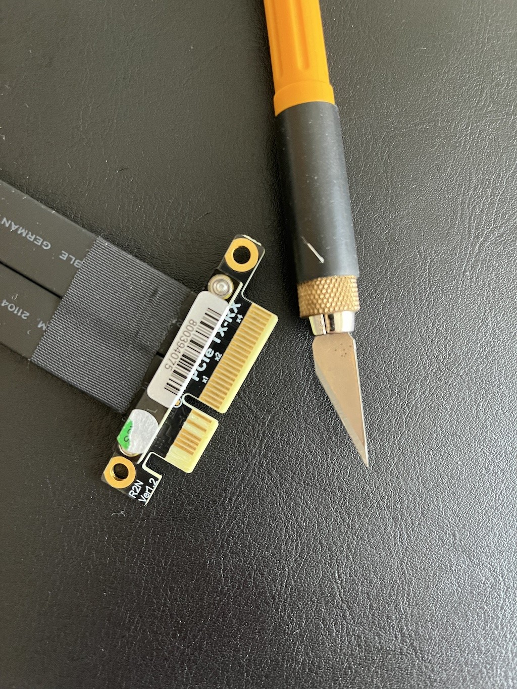

# meta-pine64

Pine64 Layer for OpenEmbedded/Yocto

## Description

This is the general hardware specific BSP overlay for the Pine64 devices.

This layer aims to support as many features as possible on Pine64 devices.
Where possible the layer aims to use opensource and upstream projects
avoiding custom forks and binary solutions.

<noscript><a href="https://liberapay.com/alistair23/donate"></a></noscript>

## Dependencies

This layer depends on:

* URI: git://github.com/openembedded/openembedded-core
  * branch: master
  * revision: HEAD
* URI: git://github.com/openembedded/bitbake
  * branch: master
  * revision: HEAD
* URI: git://git.yoctoproject.org/meta-arm
  * branch: master
  * revision: HEAD

## Building

Follow the usual steps to setup OpenEmbedded and bitbake.

For example, if you use poky it would go like this: 
```shell
git clone git://git.yoctoproject.org/poky && cd poky
git clone git://git.yoctoproject.org/meta-arm
git clone https://github.com/alistair23/meta-pine64.git
. oe-init-build-env 
bitbake-layers add-layer  ../meta-arm/meta-arm-toolchain/
bitbake-layers add-layer  ../meta-arm/meta-arm
bitbake-layers add-layer  ../meta-arm/meta-arm-bsp/
bitbake-layers add-layer ../meta-pine64/
```

### Pine A64-LTS

I don't have a board to test on, so this board is supported as best I can. If you have any problems please raise an issue on GitHub.

```
MACHINE=pine-a64-lts bitbake core-image-base
```

### SoPine Baseboard

```
MACHINE=sopine-a64 bitbake core-image-base
```

### Pine A64-Plus

```
MACHINE=pine-a64-plus bitbake core-image-base
```

### Pine RockPro64

```
MACHINE=pine-rockpro64 bitbake core-image-base
```

You can get serial access by connecting an FDTI chip to pins 8 and 10 on the
board (GND on pin 9). See the wiki for details on the pin
layout: https://wiki.pine64.org/wiki/ROCKPro64

Then attach to the console, note the high baud rate

```
screen /dev/ttyUSB0 1500000
```

### Other Pine64 Boards

Please raise a GitHub issue if you would like another board suppoted.

### Using systemd instead of SysVinit

To use systemd add this to your local.conf:

```
INIT_MANAGER = "systemd"
```
### Connecting to WiFi

To use WiFi add this to your local.conf:

```
DISTRO_FEATURES += "ipv4 ipv6 wifi"
IMAGE_INSTALL:append = "linux-firmware-rtl8723 wpa-supplicant"
```

### Displaying the kernel boot log on HDMI

To see the kernel boot log on the HDMI output, which is useful for debugging, change `recipes-bsp/u-boot/files/boot.cmd` to the following:

```
setenv bootargs console=tty0 console=ttyS0,115200 root=/dev/mmcblk0p2 rootwait
```

This results in adding `console=tty0` which will direct Linux to display the console on the display.

### Graphical display over HDMI or MIPI DSI

To use Wayland graphics add this to your local.conf:

```
DISTRO_FEATURES += "wayland opengl"
PACKAGECONFIG:append:pn-mesa = " gallium lima kmsro"
```

Then build Weston using:

```
MACHINE=sopine-a64 bitbake core-image-weston
```

To add X11 support as well add this to your local.conf:

```
DISTRO_FEATURES += "x11"
```

## Demos

Below are some demos of this layer being used with Pine64 boards.

## Deploy to SD card

If you're doing this in a Linux environment, you can use the following process to transfer the image to an SD Card.
In this example we're using the core-image-weston-pine-a64-lts.wic, if you have built a different image, update the paths accordingly.

First check your SD card path using `lsblk`.

```shell
cd tmp/deploy/images/pine-a64-lts/
sudo dd if=core-image-weston-pine-a64-lts.wic of=/dev/sd<X> bs=4M iflag=fullblock oflag=direct conv=fsync status=progress
```

Replace <X> with your results from `lsblk`.

## RockPro64 PCIe Endpoint

The RockPro64 can be used as a PCIe endpoint device attached to a host PC.

### Building the images

First to build images for endpoint mode open `conf/local.conf` and add the
following `DISTRO_FEATURES`

```
DISTRO_FEATURES:pine-rockpro64 += " pci_ep"
```

This enables the `pci_ep` distro feature, which configures options in this
layer to target PCIe endpoint support.

You can then build the images with

```
MACHINE=pine-rockpro64 bitbake core-image-base
```

Once the images are built, you will need to connect the device.

### Required hardware

You will need the following:

 * RockPro64 (4GB ram version): https://pine64.com/product/rockpro64-4gb-single-board-computer/
 * Suitable Power supply: https://pine64.com/product/12v-5a-us-power-supply/
 * A working Serial console adapter: https://pine64.com/product/serial-console-woodpecker-edition/
 * A heatsink or fan: https://pine64.com/product/rockpro64-20mm-mid-profile-heatsink/
 * A PCIe RX-TX cross cable, the R22NS model from ADT-Link: http://www.adt.link/product/R22_Jump.html has been tested and works.

### Prepare the hardware

You need to cut the 12V and 3.3V pins form one end of the PCIe cable.
Otherwise, strange things will happen as the host PC will try to start up
using PCI power from the rockpro64.

On side B: pins B1, B2, B3, B8 and B10
On side A: pins A2, A3, A9 and A10



The picture shows side B of the cable.

Insert the blade under the copper at the end of the pin and unstick the copper
from the resin board. Once the pin copper is fully raised up to the black
isolation, cut it with a small cutting pliers (cutting with the cutter knife
is possible but beware of the blade going too far as force is applied).
